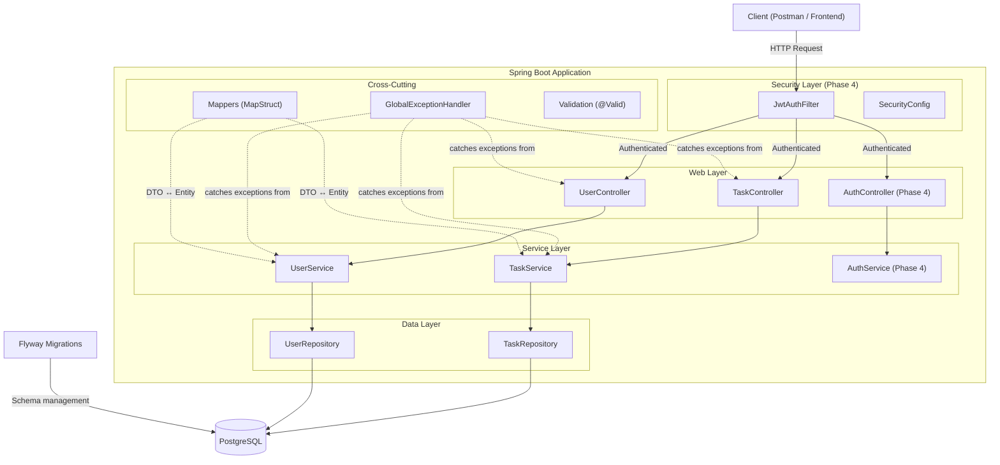

# TaskAPI — Structure Audit & Scalable Restructuring Plan

## Where You Are Right Now

Based on your action plan, you've completed **Phases 1–2 and most of Phase 3** (Days 1–8). That's solid progress. Here's
a quick status:

| Phase                             | Status        | Notes                                                            |
|-----------------------------------|---------------|------------------------------------------------------------------|
| Phase 1 — CRUD + Service Layer    | ✅ Done        | Controller → Service → Repository pattern in place               |
| Phase 2 — DB + Relationships      | ✅ Done        | PostgreSQL, JPA, Flyway, queries all working                     |
| Phase 3 — DTOs + Mapping          | ✅ Partial     | MapStruct mappers work, but validation/error handling incomplete |
| Phase 3 — Validation + Pagination | ❌ Not started | Days 9–11 still pending                                          |
| Phase 4 — Security + Testing      | ❌ Not started | Days 12–16 still pending                                         |

---

## ✅ What You Already Got Right

Your structure is actually **better than most beginners**. Specifically:

1. **Layered architecture** — Controller → Service → Repository is properly separated
2. **DTOs exist** — You're not leaking entities in API responses
3. **MapStruct** — Using code-gen mappers instead of manual mapping (professional choice)
4. **Constructor injection** — Not using `@Autowired` on fields (this is the correct way)
5. **Flyway** — Database schema managed through migrations, not `ddl-auto=create`
6. **Repository query methods** — `findAllByStatus()`, `findByTitleContainingIgnoreCase()`

---

## 🔧 Issues to Fix Now (Before Adding More Features)

These are bugs/smells in your current code that will teach you important Java/Spring concepts if you fix them yourself.

### 1. `updateTask()` in TaskService is broken

```java
// CURRENT — loses the original ID and creates a NEW row
Task updatedTaskEntity = taskMapper.toEntity(updatedTask); // ← no ID on this entity
return Optional.

of(taskRepository.save(updatedTaskEntity)).

map(taskMapper::toDTO);
```

**The problem**: `taskMapper.toEntity(updatedTask)` creates a NEW Task with `id = null`. When you `.save()` an entity
with no ID, JPA does an INSERT, not an UPDATE.

**What to learn**: How JPA decides between INSERT vs UPDATE (the presence of an `@Id` value). Look at how
`UserService.updateUser()` already does it correctly with `updateEntityFromDto()`.

> [!TIP]
> Add an `updateEntityFromDto(TaskRequestDTO dto, @MappingTarget Task entity)` method to `TaskMapper`, just like you
> already have in `UserMapper`. Then use the fetched `foundTask` (which already has an ID) and update its fields
> in-place.

---

### 2. `deleteTask()` / `deleteUser()` silently swallows errors

```java
public boolean deleteTask(Long id) {
    try {
        taskRepository.deleteById(id);  // ← throws EmptyResultDataAccessException if not found
        return true;
    } catch (Exception e) {
        return false;  // ← hides the REAL error from the caller
    }
}
```

**The problem**: If the ID doesn't exist, you return `false` — but you also return `false` for database connection
failures, constraint violations, basically any error. You can never tell what went wrong.

**What to learn**: Don't catch `Exception` broadly. Check `existsById()` first, throw `ResourceNotFoundException` if not
found, and let real errors bubble up to `GlobalExceptionHandler`.

---

### 3. `TaskResponseDTO` is missing key fields

```java
public class TaskResponseDTO {
    private Long id;
    private String title;
    private String description;
    private LocalDateTime updatedAt;
    // Missing: status, createdAt, userId/username
}
```

The client has no idea what status a task is in or who it's assigned to. Add `status`, `createdAt`, and the assigned
user's info.

---

### 4. `BadRequestException.java` is empty

This file exists but has no code. Either implement it or delete it — empty files confuse future you.

---

### 5. `ErrorResponse` doesn't use Lombok

You're using `@Getter/@Setter` on all your other classes but wrote manual getters/setters here. Be consistent.

---

### 6. `@NotBlank` on `taskStatus` in `TaskRequestDTO` is wrong

`@NotBlank` is for strings that shouldn't be empty. But `taskStatus` should really be validated as a valid enum value (
`TODO`, `IN_PROGRESS`, `DONE`), not just "not blank". A user could send `"BANANA"` and it would pass `@NotBlank` but
crash at `TaskStatus.valueOf()`.

---

## 📁 Current vs. Recommended Project Structure

Your current flat package layout works for now, but here's the scalable evolution:

### Current Structure (what you have)

```
com.example.taskapi/
├── controller/        ← TaskController, UserController, HealthController
├── dto/               ← TaskRequestDTO, TaskResponseDTO, UserRequestDTO, UserResponseDTO
├── exception/         ← GlobalExceptionHandler, ErrorResponse, ResourceNotFoundException
├── mapper/            ← TaskMapper, UserMapper
├── model/             ← Task, User, TaskStatus
├── repository/        ← TaskRepository, UserRepository
├── service/           ← TaskService, UserService
└── TaskApiApplication.java
```

### Recommended Structure (scalable evolution)

```
com.example.taskapi/
│
├── config/                          ← [NEW] App-wide config beans
│   └── WebConfig.java               ← CORS, interceptors, etc.
│
├── task/                            ← [RESTRUCTURE] Feature-based grouping
│   ├── TaskController.java
│   ├── TaskService.java
│   ├── TaskRepository.java
│   ├── Task.java                    ← Entity
│   ├── TaskStatus.java              ← Enum
│   ├── dto/
│   │   ├── TaskRequest.java         ← Drop the "DTO" suffix — it's in a dto package
│   │   └── TaskResponse.java
│   └── TaskMapper.java
│
├── user/                            ← [RESTRUCTURE] Same pattern
│   ├── UserController.java
│   ├── UserService.java
│   ├── UserRepository.java
│   ├── User.java
│   ├── dto/
│   │   ├── UserRequest.java
│   │   └── UserResponse.java
│   └── UserMapper.java
│
├── common/                          ← [RENAME from exception/]
│   ├── exception/
│   │   ├── GlobalExceptionHandler.java
│   │   ├── ResourceNotFoundException.java
│   │   └── BadRequestException.java
│   └── dto/
│       └── ErrorResponse.java
│
└── TaskApiApplication.java
```

> [!IMPORTANT]
> **Don't restructure yet!** Read the reasoning below first, and decide whether you want to do this now or after
> completing Phase 3.

### Why Feature-Based > Layer-Based?

| Layer-based (current)                                            | Feature-based (recommended)                          |
|------------------------------------------------------------------|------------------------------------------------------|
| To find "everything about tasks", you open 6 packages            | Everything about tasks is in one `task/` package     |
| Adding a new feature (e.g., `Comment`) means touching 6 packages | Adding `Comment` = create one new `comment/` package |
| Files in each package grow unbounded                             | Each feature is self-contained                       |
| Common in tutorials                                              | Common in production codebases                       |

**Django analogy**: Feature-based packages are like Django apps (`tasks/`, `users/`) where each app has its own
`models.py`, `views.py`, `serializers.py`. Your current structure is like putting all models in one file, all views in
another — it works, but doesn't scale.

---

## 🗺️ Recommended Next Steps (In Order)

### Step 1: Fix the bugs above (1-2 hours)

Fix the 6 issues listed above. This is where you'll learn the most — debugging real problems in your own code.

### Step 2: Complete Day 9 — Validation + Error Handling (2-3 hours)

Your action plan has this right. Key things:

- Add `@Valid` on `TaskController.createTask()` (you already have it on `UserController`)
- Handle `MethodArgumentNotValidException` in `GlobalExceptionHandler` to return clean field-level errors
- Implement `BadRequestException`

### Step 3: Complete Day 10 — Pagination (2 hours)

- Accept `Pageable` parameter in controller + repository
- Return `Page<TaskResponse>` instead of `List<TaskResponse>` for the list endpoint

### Step 4: Restructure to feature-based packages (1 hour)

IntelliJ makes this trivial — right-click → Refactor → Move. It updates all imports automatically. Do this **after**
things work, not before.

### Step 5: Continue with Phase 4 (Security + Testing)

Your action plan for days 12-16 is already well designed. Follow it.

---

## 🏗️ Architecture Overview (Where You're Headed)



## Open Questions

> [!IMPORTANT]
> 1. **Do you want to restructure to feature-based packages now**, or keep the current layer-based structure until you
     finish Phase 3? Both are valid — restructuring now teaches you about Java packages & refactoring, but adds a
     detour.
> 2. **Are you planning to add a frontend later?** If yes, I'd recommend adding CORS config and Swagger/OpenAPI early (
     Day 11 in your plan). If no, we can skip CORS.
